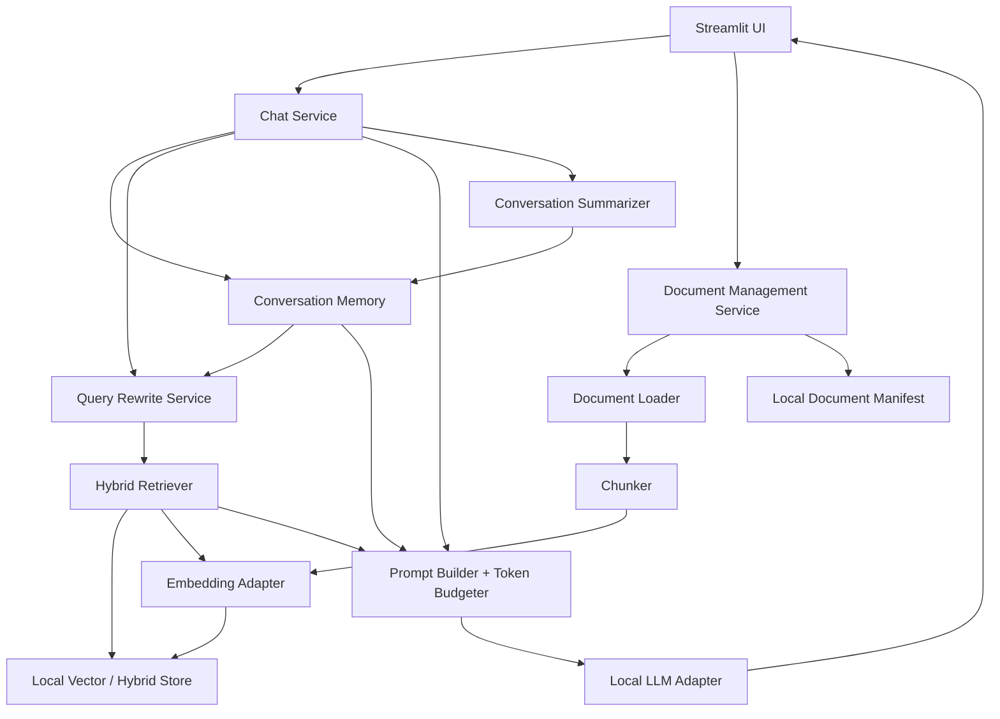
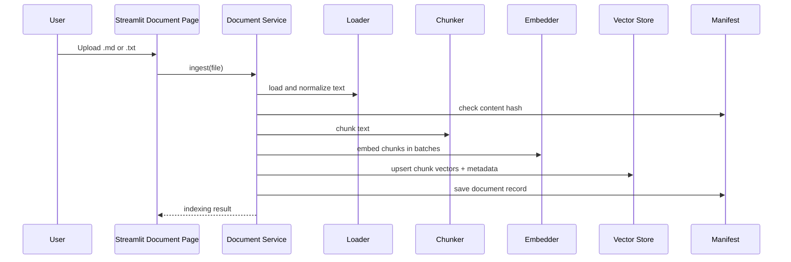
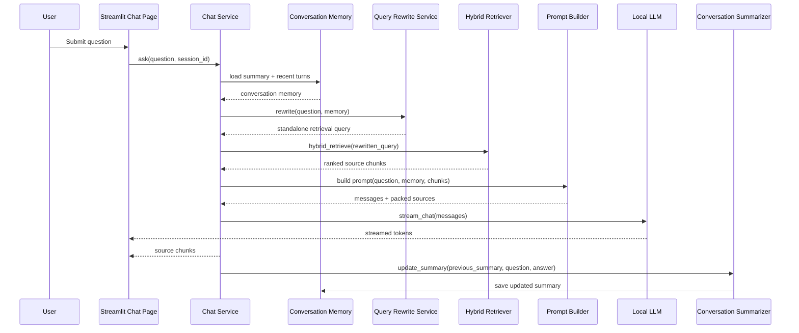

# Edge AI Local RAG Chat Demo Design Spec

Status: Implemented v1, updated to match current demo  
Date: 2026-06-25  
Target: Local-only Python RAG chat demo for HP edge AI take-home assignment

## 1. Summary

Build a local-first Retrieval-Augmented Generation chat demo that runs entirely on-device. The app will let a user upload Markdown and plain text documents, index them into a local retriever, ask questions, receive streamed local LLM answers, and inspect the retrieved source chunks used to generate each answer.

Current stack in the implemented prototype:

- **UI:** Streamlit
- **Model serving:** Ollama, behind a small Python adapter
- **Default chat model:** `llama3.2:3b`
- **Embedding model:** Ollama-served local embedding model for v1
- **Vector/retrieval storage:** LanceDB
- **Retrieval strategy:** hybrid search with dense vector retrieval plus full-text retrieval
- **Conversation strategy:** query rewrite plus running chat-history summary
- **Chat orchestration:** raw Python service code, not LangChain for the first version

The main design principle is explainability. The assignment explicitly values clean organization and the ability to explain every design decision, so the system should avoid framework magic unless it saves meaningful time without hiding the core flow.

## 2. Goals

- Run fully locally, with no cloud LLM or cloud embedding services.
- Support `.md` and `.txt` document ingestion.
- Store document chunks and metadata locally.
- Retrieve relevant chunks for a user query.
- Rewrite conversational follow-up questions into standalone retrieval queries.
- Maintain a local running summary of chat history for follow-up questions.
- Generate answers with a local LLM.
- Stream generated output in the UI.
- Show source chunks used for each answer.
- Enforce an application-level 6,000-token working-context budget.
- Keep the architecture clean enough to explain in a demo.

## 3. Non-Goals

- No PDF, DOCX, HTML, image, or audio ingestion in the first prototype.
- No cloud model APIs.
- No multi-user auth, role permissions, or hosted deployment.
- No fine-tuning.
- No production observability stack.
- No complex agent workflow unless added later.
- No advanced evaluation harness in the first implementation, beyond a small manual demo dataset and smoke tests.

## 4. Hardware And Runtime Assumptions

Current development machine detected:

- Apple Silicon: `arm64`
- CPU family: Apple M3
- Memory: 16 GB unified memory
- Ollama is installed locally for the current demo.
- Current default chat model: `llama3.2:3b`.
- Current embedding model: `embeddinggemma`.

Design implication:

- Prefer small local instruct/chat models for interactive latency.
- Avoid large 14B+ models for the initial demo unless the runtime proves responsive.
- Keep context at about 6k tokens as required, even if the selected model supports more.
- Make model names configurable so we can switch models without rewriting application logic.

## 5. Architecture Overview



The system is split into four conceptual layers:

1. **Model layer:** local embedding and language model adapters.
2. **Retriever layer:** document loading, chunking, embedding, vector storage, and retrieval.
3. **Chatbot layer:** query rewrite, conversation memory, retrieval orchestration, prompt assembly, token budgeting, summarization, and streaming response generation.
4. **UI layer:** Streamlit chat and document management pages.

## 6. Recommended Design Decisions

### 6.0 Finalized Implementation Decision

The finalized first implementation is:

- **Runtime:** Ollama
- **LLM:** configurable local chat model, currently `llama3.2:3b`
- **Embedding:** Ollama-served embedding model, starting with `embeddinggemma` and falling back to `all-minilm` if needed
- **Vector DB:** LanceDB
- **Retrieval:** hybrid LanceDB retrieval from day one, with dense fallback only if full-text index creation fails
- **Retrieved chunks:** `top_k = 4` by default for lower local latency and tighter prompts
- **Query handling:** rewrite every user message into a standalone retrieval query before searching
- **Conversation memory:** include a running chat summary plus the most recent raw turns in context
- **Chat orchestration:** raw Python service code
- **UI:** Streamlit

This gives us a local-only, explainable system with a stronger retrieval story than a basic dense-only Chroma demo, while still avoiding extra infrastructure like Docker or a separate Qdrant server. The design intentionally includes query rewrite and memory summarization in v1 because the demo should showcase a mature RAG mechanism rather than the smallest possible pipeline.

### 6.1 Model Serving

Recommendation: **Use Ollama for the first prototype.**

Why:

- It is easy to install and operate locally.
- It has an official Python library.
- It supports streaming responses through `stream=True`.
- It supports local embedding models.
- It exposes a local API by default.
- It lets us set context behavior with `num_ctx` or related runtime settings.
- It is easier to script and reproduce than a GUI-first workflow.

Alternatives:

| Option | Pros | Cons | Fit |
| --- | --- | --- | --- |
| Ollama | Simple, scriptable, Python client, local chat and embeddings, streaming | Must install separately; model availability depends on local pulls | Best default |
| LM Studio | Very friendly GUI, local server, OpenAI-compatible API | More manual GUI state; less ideal for reproducible scripts | Good fallback |
| llama.cpp server | Very low-level control, quantized GGUF support, OpenAI-compatible routes | More setup and tuning work | Good if asked to explain low-level serving |
| MLX / MLX-LM | Apple Silicon optimized | More niche, more setup risk for a take-home | Later optimization |
| vLLM / vLLM-Metal | Strong serving stack, high throughput | More infrastructure than needed for one-user demo | Overkill for MVP |
| Jan | Local OpenAI-compatible desktop server | Another app dependency; not necessary if using Ollama/LM Studio | Optional fallback |

Model adapter implementation:

- The application does not call Ollama directly from UI code.
- `LocalLLMClient` defines methods such as `stream_chat(messages, options)`, `complete_prompt(prompt, options)`, and `healthcheck()`.
- `OllamaLLMClient` is the implemented v1 adapter.
- Keep an OpenAI-compatible adapter possible for LM Studio later.

### 6.2 Language Model Choice

Recommendation: make the LLM model configurable, then start with a small chat
model that runs comfortably on a 16 GB M3 Mac.

Current implemented default:

- `llama3.2:3b` for chat generation.
- `embeddinggemma` for embeddings.

Why not `qwen3:4b` as the default:

- It is a capable local model, but it produced Qwen3-style thinking output in
  the demo even with `think = false` and `/no_think`.
- That behavior is useful to understand, but noisy for a take-home demo where
  the answer should stream cleanly.
- The Ollama adapter still contains defensive handling for thinking-capable
  models, but the demo default should be reliable and easy to explain.

Suggested config shape:

```toml
[models]
llm_provider = "ollama"
llm_model = "llama3.2:3b"
embedding_provider = "ollama"
embedding_model = "embeddinggemma"

[generation]
num_ctx = 6144
num_predict = 512
temperature = 0.2
top_p = 0.9
think = false
```

Notes:

- `num_ctx` can be set slightly above the application budget, such as 6144, while the app itself packs prompt plus reserved response space to 6000 tokens or less.
- Temperature should be low for grounded QA, around `0.1` to `0.3`.
- Exact model names should be verified after installing Ollama and pulling models.

### 6.3 Embedding Model

Recommendation for v1: **use an Ollama-served embedding model** to keep all model operations behind one local runtime.

Good initial options:

- `embeddinggemma`
- `qwen3-embedding`
- `all-minilm`
- `nomic-embed-text`

Alternative: use `sentence-transformers` directly in Python.

Direct `sentence-transformers` is attractive when:

- We want embedding generation independent from the LLM server.
- We want predictable local batch embedding behavior.
- We are comfortable managing Hugging Face model downloads/caches.

For the take-home, Ollama embeddings are easier to explain as "one local model runtime handles both generation and embedding." Sentence Transformers is still a strong fallback if Ollama embedding support or model availability becomes annoying.

### 6.4 Vector Database / Retriever Store

Recommendation: **Use LanceDB.**

Why LanceDB:

- Runs locally as an embedded database.
- Stores vector data and metadata in local files.
- Supports vector search, full-text search, and hybrid search.
- Its hybrid search can combine semantic and full-text results with reciprocal rank fusion.
- It avoids requiring a separate local server or Docker container.

Alternative if we want the most common beginner RAG stack: **Use ChromaDB.**

Why ChromaDB:

- Very common in Python RAG demos.
- Easy local persistent client.
- Simple collection APIs for add, query, get, update, and delete.
- Good enough for dense vector retrieval.

ChromaDB tradeoff:

- Chroma's local open-source path is strongest for dense vector search.
- If we want hybrid search, we would likely implement lexical retrieval ourselves with BM25 or TF-IDF and fuse results in Python.

Other options:

| Option | Pros | Cons | Fit |
| --- | --- | --- | --- |
| LanceDB | Local embedded DB, vector + full-text + hybrid, no server | Slightly less common than Chroma in tutorials | Best if hybrid matters |
| ChromaDB | Common, simple, persistent local client | Hybrid requires extra sidecar logic | Best if simplicity matters |
| Qdrant | Excellent vector DB, strong hybrid query API | Usually involves running a local server/container | Best for production-like retrieval |
| FAISS | Fast vector search library | No document management, metadata, or UI-friendly delete/update layer by itself | Not ideal for this demo |

Final recommendation:

- Use **LanceDB** for the default implementation.
- Keep **ChromaDB + simple BM25 sidecar** as the fallback if LanceDB creates setup friction.
- Do not use FAISS as the main store for this assignment.

Local storage scope:

- The demo should comfortably support small-to-medium local document collections.
- Target scale for v1: dozens to a few hundred `.md` and `.txt` files, or a few thousand chunks.
- Store uploaded files under `data/uploads`, LanceDB data under `data/index`, and the document/conversation manifest in local SQLite.
- Do not claim production-scale performance for very large corpora; the point is a strong local architecture that can be extended.

### 6.5 Chat Orchestration

Recommendation: **Use raw Python orchestration for the first prototype.**

Why:

- The assignment values understanding and explainability.
- Raw Python makes the pipeline obvious: query, embed, retrieve, pack prompt, call model, stream response.
- Avoids LangChain abstractions that may obscure the core flow.
- Keeps debugging easier under time pressure.

LangChain alternative:

- LangChain has mature RAG tutorials, local model integrations, retrievers, and streaming patterns.
- It is useful if speed matters more than showing custom architecture.
- It may be less compelling in a take-home where the reviewer asks how each part works.

Proposed approach:

- Build small service classes with explicit method boundaries.
- Use third-party libraries for concrete tasks, such as vector DB, embedding client, and token counting.
- Do not build a complex agent.
- Include query rewrite and conversation memory as explicit, testable services rather than framework-managed magic.

### 6.6 Query Rewrite And Conversation Memory

Final decision: **Enable query rewrite in v1 and include conversation memory in the prompt.**

The chat pipeline should use:

1. The latest user message.
2. A running summary of the conversation so far.
3. The last few raw turns for short-term conversational detail.
4. A local LLM rewrite step that converts the latest message into a standalone retrieval query.
5. Hybrid retrieval over LanceDB using the rewritten query.
6. Prompt assembly using the original user message, conversation memory, and retrieved chunks.
7. Answer generation and streaming.
8. A post-answer summary update.

Why:

- Query rewrite shows a more mature RAG mechanism than direct embedding of every user message.
- Conversation summary makes follow-up questions work without stuffing the full chat transcript into the 6k context.
- Keeping rewrite and summarization as explicit services makes the mechanism explainable during the demo.
- The latency tradeoff is acceptable for this take-home because the goal is to showcase retrieval quality and system design, not only the fastest possible path.

Design:

- Query rewrite is enabled by default.
- The UI may expose a debug expander showing the rewritten query, but it should not make rewrite feel like an unfinished optional feature.
- If query rewrite fails, fall back to the original user query and show a non-blocking warning.
- After every completed answer, update the running summary in a background or post-response task.
- If summary update fails, keep the previous summary and continue the chat.

## 7. Retriever Layer Design

### 7.1 Document Manifest

The system should maintain a local manifest of uploaded documents.

Recommended fields:

- `doc_id`: stable SHA256 hash of normalized file name plus file content.
- `filename`
- `source_path`
- `content_hash`
- `file_type`
- `size_bytes`
- `created_at`
- `updated_at`
- `chunk_count`
- `embedding_model`
- `status`: `indexed`, `failed`, or `deleted`
- `error_message`

Storage options:

- SQLite manifest plus LanceDB/Chroma chunk store.
- Or a separate table in LanceDB if using LanceDB.

Recommendation:

- Use **SQLite for the document manifest** and the vector DB for chunks.
- This makes document management explicit and easy to explain.

### 7.2 Chunk Data Model

Each chunk stored in the retriever should include:

- `chunk_id`: `${doc_id}:${chunk_index}`
- `doc_id`
- `filename`
- `chunk_index`
- `text`
- `embedding`
- `start_char`
- `end_char`
- `token_count_estimate`
- `content_hash`
- `created_at`

The UI should display source chunks using:

- Filename
- Chunk index
- Similarity or hybrid score
- Text snippet
- Optional full chunk text inside an expander

### 7.3 Loading

Supported files:

- `.md`
- `.txt`

Rules:

- Decode as UTF-8.
- If UTF-8 fails, show a clean error in the document management page.
- Normalize line endings.
- Strip excessive trailing whitespace.
- Preserve Markdown headings because they help chunk context.

### 7.4 Chunking

Recommendation:

- Use a simple recursive text splitter.
- Prefer heading-aware splitting for Markdown when practical.
- Target chunk size: 350 to 500 tokens.
- Chunk overlap: 50 to 80 tokens.

Why:

- Chunks need to be small enough to pack several sources into a 6k context.
- Overlap protects against splitting useful context at boundaries.
- Heading-aware Markdown splitting improves source readability.

Initial chunking algorithm:

1. Split Markdown documents by headings when possible.
2. Split large sections into paragraph groups.
3. Split oversized paragraphs by sentence or character boundary.
4. Apply overlap between adjacent chunks.
5. Store chunk metadata with source offsets.

### 7.5 Ingestion Flow



Duplicate handling:

- If a document with the same content hash already exists, skip re-indexing and show "already indexed."
- If same filename but new hash, create a new `doc_id` or replace the old document depending on the selected UI action.

Deletion:

- Delete document from manifest.
- Delete all chunks with matching `doc_id` from vector store.
- Keep uploaded file on disk only if we want reindex support; otherwise remove it.

## 8. Chatbot Layer Design

### 8.1 Chat Flow



### 8.2 Retrieval Strategy

V1 retrieval:

- Use the rewritten standalone retrieval query.
- Run dense vector search through the local embedding model.
- Run LanceDB full-text search against chunk text.
- Fuse dense and full-text results with reciprocal rank fusion.
- Return top `k = 4` by default for the demo. Increase this if answer quality
  needs broader context and latency is acceptable.
- Pack highest-ranked chunks until the context budget is reached.

Fallback retrieval:

- If full-text index creation fails, run dense vector retrieval only.
- If query rewrite fails, retrieve with the original user question.
- If LanceDB setup creates unexpected friction, use ChromaDB dense retrieval as the contingency path.

### 8.3 Prompt Strategy

System prompt should be strict and grounded:

```text
You are a local RAG assistant. Answer the user's question using only the provided context.
If the context is insufficient, say that the documents do not contain enough information.
Do not invent sources. Cite source chunk IDs when making factual claims.
Keep the answer concise and clear.
```

Conversation memory format:

```text
Conversation summary:
<running summary of prior conversation>

Recent turns:
User: <previous user message>
Assistant: <previous assistant answer>
```

Context format:

```text
[source: filename.md | chunk: 3 | score: 0.82]
<chunk text>

[source: notes.txt | chunk: 1 | score: 0.77]
<chunk text>
```

User message:

```text
Question to answer now:
<user question>

Standalone retrieval query used:
<rewritten standalone retrieval query>

Conversation memory (for reference only; do not answer old questions):
<summary and recent turns>

Retrieved context:
<packed source chunks>

Answer only this latest question: <user question>
```

### 8.4 Context Window Enforcement

Requirement: limit context window to about 6,000 tokens.

Recommended budget:

- Total working context budget: 6,000 tokens.
- System prompt: up to 300 tokens.
- Current user query and rewritten retrieval query: up to 350 tokens.
- Running conversation summary: up to 600 tokens.
- Recent raw turns: up to 500 tokens.
- Retrieved chunks: up to 3,400 tokens.
- Formatting and safety margin: about 50 tokens.
- Reserved response space: about 800 tokens.

Generation budget:

- Reserve response generation budget using model runtime options where available.
- Keep prompt plus reserved response space under 6,000 tokens.
- Configure Ollama runtime with `num_ctx = 6144` and pack the working context to 6,000 or less.

Token counting:

- Add a `TokenCounter` abstraction.
- V1 can use a conservative heuristic if exact tokenizer access is not ready.
- Better version can use the tokenizer corresponding to the selected model.

Packing algorithm:

1. Count fixed prompt tokens.
2. Reserve safety margin.
3. Add the conversation summary if it fits; otherwise truncate the summary.
4. Add recent raw turns if they fit; otherwise drop older turns first.
5. Iterate ranked chunks.
6. Include a chunk only if it fits.
7. Stop when budget is exhausted.
8. Record which chunks were used so UI sources match the prompt.

### 8.5 Query Rewrite

The query rewrite service should use the local LLM to produce a standalone search query.

Inputs:

- Latest user message.
- Running conversation summary.
- Last few raw turns.

Output:

- `rewritten_query`
- `rewrite_used`: boolean
- `rewrite_error`: optional error string

Rewrite prompt requirements:

- Preserve exact technical terms, filenames, model names, API names, and acronyms.
- Resolve references like "it", "that", "the previous one", or "this model" using conversation memory.
- Do not answer the question.
- Return only the standalone retrieval query.

Fallback:

- If rewrite fails or returns an empty query, use the original user message.

### 8.6 Conversation Memory And Summarization

The system should include both short-term and long-term conversation memory:

- **Short-term memory:** last 1 to 2 raw user/assistant turns, stored in Streamlit session state.
- **Long-term session memory:** a running summary, updated after each completed answer and stored locally.

Summary update flow:

1. Capture the previous summary.
2. Capture the latest user question.
3. Capture the final assistant answer.
4. Ask the local LLM to produce an updated compact summary.
5. Save the updated summary for the session.

Summary constraints:

- Keep the summary under about 600 tokens.
- Preserve user goals, constraints, selected tools, unresolved questions, and important entities.
- Do not include large source excerpts.
- Do not include sensitive content beyond what is needed for continuity.

Background behavior:

- The summary update should run after the answer has streamed so it does not delay first-token latency.
- In Streamlit, the first implementation can run the summary update as a post-response task and show a small "updating memory" status.
- If a safe background thread is added later, it must not mutate Streamlit UI state directly; it should write to a thread-safe local store and refresh on the next rerun.

Persistence:

- Store conversation sessions and summaries in local SQLite.
- Keep raw chat turns in Streamlit session state for the live session.
- Persist only the summary and minimal turn metadata needed for demo continuity.

### 8.7 Streaming

Model adapter should expose a generator:

```python
def stream_chat(messages: list[dict], options: dict) -> Iterator[str]:
    ...
```

Streamlit can render that generator with `st.write_stream`.

The source chunks should be displayed after or alongside the streamed answer. For v1, show them below the assistant response in expanders.

## 9. UI Layer Design

### 9.1 Streamlit Layout

Use one Streamlit app with sidebar navigation.

Sidebar:

- App title
- Page selector:
  - Chat
  - Documents
- Model status indicator
- Current LLM model
- Current embedding model
- Retrieval mode indicator:
  - Hybrid
- Query rewrite status indicator
- Conversation memory status indicator

### 9.2 Chat Page

Core behavior:

- Display previous chat messages.
- Accept a user question through `st.chat_input`.
- Rewrite the question into a standalone retrieval query.
- Stream assistant output.
- Show retrieved source chunks for the answer.
- Show the rewritten query in a debug expander.
- Show whether conversation summary was updated.
- Warn if no documents are indexed.
- Warn if local model server is unavailable.

Answer display:

- Assistant answer in chat message.
- Sources below answer:
  - `filename`
  - `chunk_index`
  - score
  - excerpt
  - expander for full text

Optional controls:

- Clear chat
- Show or hide retrieval debug details
- Number of chunks
- Reset conversation memory

### 9.3 Document Management Page

Core behavior:

- Upload one or more `.md` or `.txt` files.
- Show indexing progress.
- List indexed documents.
- Show per-document metadata:
  - filename
  - file type
  - size
  - chunk count
  - indexed timestamp
  - embedding model
  - status
- Delete a document and all associated chunks.
- Reindex a document if the embedding model changes.

V1 actions:

- Upload
- Index
- Delete
- Refresh list

Nice-to-have actions:

- Preview chunks
- Reindex all
- Clear index
- Export manifest

## 10. Proposed File Structure

```text
local-RAG/
  TAKE_HOME_ASSIGNMENT.md
  docs/
    EDGE_AI_RAG_DESIGN_SPEC.md
  app.py
  pyproject.toml
  README.md
  rag_demo/
    __init__.py
    config.py
    models/
      __init__.py
      base.py
      ollama_client.py
    embeddings/
      __init__.py
      base.py
      ollama_embedder.py
    ingestion/
      __init__.py
      loader.py
      chunker.py
      pipeline.py
    retrieval/
      __init__.py
      store.py
      retriever.py
      fusion.py
    chat/
      __init__.py
      memory.py
      prompt.py
      query_rewrite.py
      schemas.py
      service.py
      summarizer.py
      token_budget.py
    storage/
      __init__.py
      conversation_store.py
      manifest.py
    ui/
      __init__.py
      chat_page.py
      documents_page.py
      sidebar.py
  data/
    uploads/
    index/
    app.db
  tests/
    test_chunker.py
    test_chat_service.py
    test_conversation_memory.py
    test_token_budget.py
    test_prompt_builder.py
    test_query_rewrite.py
    test_manifest.py
```

File responsibility notes:

- `app.py`: Streamlit entrypoint and page routing only.
- `config.py`: model names, DB paths, retrieval defaults, token budgets.
- `models/base.py`: LLM adapter interface.
- `models/ollama_client.py`: Ollama chat/stream implementation.
- `embeddings/base.py`: embedding adapter interface.
- `embeddings/ollama_embedder.py`: Ollama embedding implementation.
- `ingestion/loader.py`: `.md` and `.txt` loading and validation.
- `ingestion/chunker.py`: text splitting.
- `ingestion/pipeline.py`: load, chunk, embed, store.
- `retrieval/store.py`: vector DB wrapper.
- `retrieval/retriever.py`: dense or hybrid retrieval.
- `retrieval/fusion.py`: RRF if not using a DB-native hybrid path.
- `chat/memory.py`: conversation memory object combining running summary and recent turns.
- `chat/prompt.py`: prompt construction.
- `chat/query_rewrite.py`: standalone query rewrite using the local LLM.
- `chat/schemas.py`: typed data structures for chat requests, retrieval results, sources, and memory.
- `chat/token_budget.py`: token counting and context packing.
- `chat/service.py`: query-to-answer orchestration.
- `chat/summarizer.py`: post-answer running summary update.
- `storage/conversation_store.py`: SQLite conversation summary persistence.
- `storage/manifest.py`: SQLite document manifest.
- `ui/*`: Streamlit rendering only.

## 11. Configuration

Current recommended config defaults:

```toml
[paths]
upload_dir = "data/uploads"
index_dir = "data/index"
manifest_db = "data/app.db"

[models]
llm_provider = "ollama"
llm_model = "llama3.2:3b"
embedding_provider = "ollama"
embedding_model = "embeddinggemma"
ollama_host = "http://localhost:11434"

[generation]
num_ctx = 6144
num_predict = 512
temperature = 0.2
top_p = 0.9
think = false

[retrieval]
vector_store = "lancedb"
mode = "hybrid"
top_k = 4
chunk_token_size = 450
chunk_token_overlap = 70
full_text_index = true

[query_rewrite]
enabled = true
fallback_to_original_query = true

[memory]
enabled = true
summary_token_budget = 600
recent_turns = 2
update_after_each_answer = true

[context_budget]
max_working_context_tokens = 6000
reserved_response_tokens = 800
reserved_system_tokens = 300
reserved_memory_summary_tokens = 600
reserved_recent_turn_tokens = 500
reserved_query_tokens = 350
safety_margin_tokens = 50
```

All config should be local and committed with safe defaults. No API keys should be required.

## 12. Error Handling

Model server unavailable:

- Show clear UI message: local model server is not reachable.
- Include expected local URL and selected provider.

No indexed documents:

- Chat page should ask user to upload documents first.

Unsupported file type:

- Reject with a clear message.

Duplicate document:

- Skip indexing and show existing document record.

Embedding model changed:

- Warn that existing index was built with a different embedding model.
- Offer reindex action.

Prompt too large:

- Drop lower-ranked chunks until the prompt fits.
- If no chunks fit, answer with insufficient context.

Query rewrite fails:

- Fall back to the original user question as the retrieval query.
- Record the rewrite error for debug display.

Conversation summary update fails:

- Keep the previous summary.
- Continue the chat without blocking the user.
- Show a non-blocking warning in the debug area.

Retrieval returns no results:

- Ask the model to say the documents do not contain enough information.

## 13. Testing And Demo Verification

Minimum tests:

- Loader accepts `.md` and `.txt`, rejects unsupported extensions.
- Chunker creates stable chunk IDs and preserves text.
- Token budgeter never returns a prompt above 6,000 tokens.
- Manifest can add, list, update, and delete document records.
- Prompt builder includes only packed chunks and exposes the same chunks as sources.
- Query rewrite falls back to the original question on empty or failed rewrite.
- Conversation summarizer preserves important constraints and keeps summary under budget.
- Chat service passes rewritten query to retriever and original question to answer prompt.

Manual demo checklist:

1. Start local model server.
2. Launch Streamlit app.
3. Upload a Markdown file.
4. Confirm document appears on the Documents page.
5. Ask a question whose answer exists in the document.
6. Confirm the rewritten query is visible in the debug expander.
7. Confirm hybrid retrieval returns source chunks.
8. Confirm the pipeline status table shows memory, rewrite, retrieval, prompt,
   generation, memory update, and summary timing.
9. Confirm the answer streams.
10. Confirm sources are shown below the answer.
11. Ask a follow-up question that depends on chat history.
12. Confirm the rewritten query resolves the follow-up.
13. Delete the document.
14. Ask the same question again and confirm retrieval no longer finds that source.
15. Confirm no cloud model or embedding service is configured.

## 14. Implementation Phases

Phase 1: Foundation

- Create Python project structure.
- Add config.
- Add local paths.
- Add basic tests.

Phase 2: Model adapters

- Add Ollama healthcheck.
- Add streaming chat method.
- Add embedding method.
- Add setup instructions for pulling models.

Phase 3: Ingestion

- Add file loader.
- Add chunker.
- Add document manifest.
- Add ingestion pipeline.

Phase 4: Retriever

- Add selected vector DB wrapper.
- Add dense retrieval.
- Add LanceDB hybrid retrieval with dense fallback.
- Return ranked chunks with scores and metadata.

Phase 5: Chat service

- Add query rewrite service.
- Add conversation memory model.
- Add conversation summarizer.
- Add conversation summary persistence.
- Add prompt builder.
- Add token budget enforcement.
- Add chat orchestration.
- Add streamed response path.

Phase 6: Streamlit UI

- Add sidebar navigation.
- Add chat page.
- Add document management page.
- Add source display.

Phase 7: Verification

- Add sample documents.
- Run unit tests.
- Run manual demo checklist.
- Update README with setup and demo script.

## 15. Finalized Design Decisions

These decisions are locked for the first implementation:

1. **Retrieval architecture:** show a stronger retrieval architecture from day one, not the smallest dense-only RAG baseline.
2. **Model runtime:** use Ollama for local LLM and embedding model serving.
3. **Local storage scale:** support whatever can be handled comfortably with LanceDB and local filesystem/SQLite storage on the development machine; target small-to-medium local document collections rather than production-scale corpora.
4. **Chat history:** include conversation history through a running summary plus the most recent raw turns.
5. **Background summarization:** update the running conversation summary after each completed answer so follow-up questions have compact context.
6. **Query rewrite:** include query rewrite in the first version to demonstrate a more mature RAG mechanism.
7. **Framework stance:** keep orchestration in explicit Python services rather than hiding the pipeline inside LangChain or another high-level framework.

## 16. Research Notes And Sources

Primary sources checked:

- Ollama Python library supports streaming with `stream=True`: https://github.com/ollama/ollama-python
- Ollama embeddings documentation describes local embedding vectors for RAG and recommended embedding models: https://docs.ollama.com/capabilities/embeddings
- Ollama context length documentation explains context length and runtime defaults: https://docs.ollama.com/context-length
- Ollama FAQ documents `OLLAMA_CONTEXT_LENGTH` and API `num_ctx`: https://docs.ollama.com/faq
- LM Studio can serve local LLMs on localhost and exposes OpenAI-compatible endpoints: https://lmstudio.ai/docs/developer/core/server
- LM Studio OpenAI compatibility uses local base URL such as `http://localhost:1234/v1`: https://lmstudio.ai/docs/developer/openai-compat
- llama.cpp server supports OpenAI-compatible chat completions, responses, and embeddings routes: https://github.com/ggml-org/llama.cpp/blob/master/tools/server/README.md
- LanceDB hybrid search combines vector and full-text search with reranking/RRF: https://docs.lancedb.com/search/hybrid-search
- Qdrant hybrid query docs describe RRF as a safe default without an eval set: https://qdrant.tech/documentation/search/hybrid-queries/
- Chroma Query API supports nearest-neighbor dense embedding search: https://docs.trychroma.com/docs/querying-collections/query-and-get
- Chroma persistent client stores data at a local path: https://docs.trychroma.com/docs/run-chroma/clients
- LangChain retrieval docs distinguish RAG agents from simpler 2-step RAG chains: https://docs.langchain.com/oss/python/langchain/retrieval
- Sentence Transformers supports local embeddings and rerankers: https://sbert.net/
- Streamlit chat tutorial covers chat messages, chat input, session state, and streaming UI patterns: https://docs.streamlit.io/develop/tutorials/chat-and-llm-apps/build-conversational-apps
- Streamlit `st.chat_input` supports chat input and optional file attachment behavior: https://docs.streamlit.io/develop/api-reference/chat/st.chat_input
- Streamlit `st.file_uploader` supports local file uploads with extension filtering: https://docs.streamlit.io/develop/api-reference/widgets/st.file_uploader
- Streamlit `st.write_stream` streams generators or iterables into the app: https://docs.streamlit.io/develop/api-reference/write-magic/st.write_stream
- Streamlit sidebar docs support sidebar widgets and navigation-style controls: https://docs.streamlit.io/develop/api-reference/layout/st.sidebar
